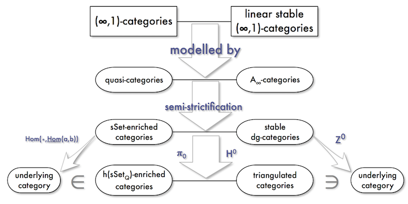
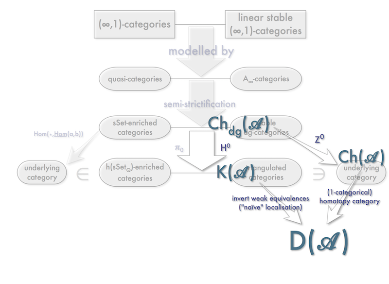

This post assumes that you have seen the construction of derived categories and maybe the definitions of dg- and $A_\infty$-categories, and wondered how they all linked together.
In particular, as an undergraduate I was always confused as to what the difference was between the two steps of constructing the derived category of chain complexes was: taking equivalence classes of chain homotopic complexes; and then formally inverting all quasi-isomorphisms.
Both of them seemed to be some sort of quotienting/equivalence-class-like action, so why not do them at the same time?
What different roles were played by each step?

<!-- more -->

_This post could have many errors, and I don't understand the proofs for many of the things I vaguely imply; I just mildly believe._
_Please do let me know if there is anything grossly misleading or just plain wrong._

# Warnings

First of all, there are two points that I want to make about choices of language that I think are really very confusing.

1. When we talk about derived categories, we are using this word in the opposite sense to pretty much every other usage of the word in modern mathematics^[Namely _derived algebraic geometry_, and its siblings, and its cousins, and... etc.]: a **derived category** is like a homotopy truncation (i.e. the $\pi_0$) of some thing with much higher homotopical data; a **derived scheme/stack/whatever** is something whose $\pi_0$ is the corresponding classical object.
    Derived 'algebraic/geometric objects' _have_ homotopy truncations; derived categories _are_ homotopy truncations.
2. When we quotient the category of chain complexes by the equivalence relation given by chain homotopy, we usually call the resulting category $K(\mathcal{A})$ the **homotopy category of chain complexes**.
    This is maybe not the best nomenclature, in some sense, because the category that 'truly' deserves this name is the _actual_ homotopy category of chain complexes $\mathrm{Ho}\mathsf{Ch}(\mathcal{A})$, which is, by definition, the derived category $D(\mathcal{A})$.
    Because of this, I won't refer to $K(\mathcal{A})$ as anything but $K(\mathcal{A})$.

# A nice diagram

Without further ado, here is a diagram that attempts to explain the relationships between various things that you might have learnt about in various places.

Here are a few words about the above diagram.

- The structure of a _triangulated category_ is essentially the structure that the category $\mathrm{Ho}(\mathcal{C})$ inherits from the fact that $\mathcal{C}$ is a _stable_ $(\infty,1)$-category.
    The equivalent notion in the more general case (the left-hand side of the diagram) is the structure inherent to $\mathrm{h}(\mathcal{C})$ from an $(\infty,1)$-category viewed as a quasi-category (and thus, in particular, simplicial set).
- A _stable dg-category_ is also known as an _enhanced triangulated category_ or a _pretriangulated category_.
- If we wanted to draw a column in the middle for _stable_ $(\infty,1)$-categories that _aren't necessarily linear_, then we'd arrive at the notion of a _spectral category_ instead of a dg-category.

Now here is a picture of where the derived category of chain complexes fits in to all this.

Here are a few words about the above diagram.

- We can understand the definition of _chain homotopies_ much better if we understand the idea of the [interval object in chain complexes](https://ncatlab.org/nlab/show/interval+object+in+chain+complexes).
- As said at the beginning of this post, there _is_ a difference between passing from $\mathsf{Ch}(\mathcal{A})$ to $K(\mathcal{A})$ and from $K(\mathcal{A})$ to $D(\mathcal{A})$, i.e. quotienting and localising have no reason to behave similarly^[Think of rings (for some reason localisations and quotients of rings don't look as confusingly similar to me as the categorical versions do).].
    _But_, there is a model structure that we can put on $\mathsf{Ch}(\mathcal{A})$, and so there _is_ some link between the two: to quote from [a mathoverflow answer by Simon Henry](https://mathoverflow.net/a/188199/73622),
    
    > _The reason why they give the same things in a lot of example (including chain complexes), giving the idea that they should be related, is because these examples are Quillen model categories and that it is the main result of Quillen's "Homotopical Algebra" (where he defined model categories) that for Quillen model category the localization by weak equialence can be constructed as a quotient of the full subcategory of fibrant-cofibrant objects._

    There is, however, the slightly confusing fact that the construction of $K(\mathcal{A})$ as a quotient _does_ agree with a localisation construction (as explained [here](https://math.stackexchange.com/a/1128937/71510)).

# Unresolved confusions

I still don't fully see the link between the homotopy category $\mathrm{h}(\mathcal{C})$ and the homotopy category $\mathrm{Ho}(\mathcal{C})$ and localisation in general (e.g. I 'know' that $\mathrm{Ho}(\mathcal{C})(a,b)\simeq\pi_0(\mathrm{L}\mathcal{C}(a,b))$, where $\mathrm{L}$ is the simplicial localisation, but that's about it).

You know what?
There are a lot of things that I still don't understand, but oh my goodness am I having fun trying to figure it all out.
