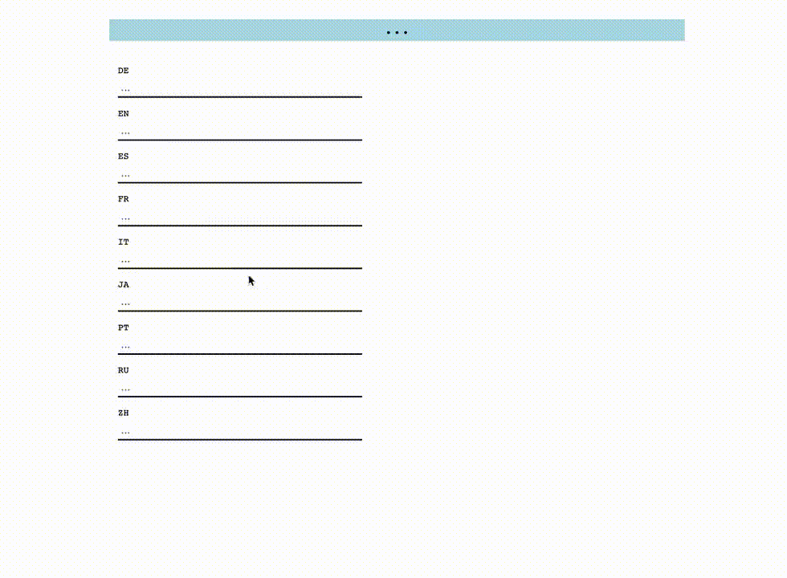
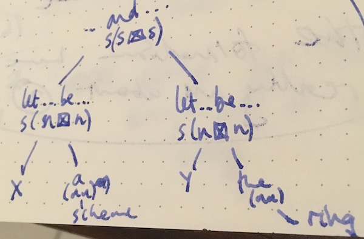
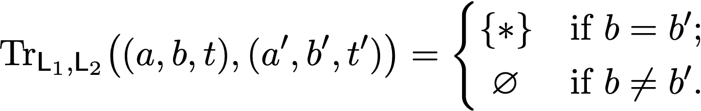

Being unable to ever properly finish any project that I start, but loving starting new projects, has made getting around to typing up this blog post quite an effort.
Not only that, but it's also unsatisfying to me how much I've failed to understand the categorical framework behind my translation project, so it's mildly intimidating (to say the least) to present this stuff to the whole internet (although, in actuality, it's really just to the one (mabye two) reader(s) of this blog), but I'm doing so in the hopes that somebody who actually knows about this sort of applied category theory can help me get somewhat closer to a solid understanding.

<!-- more -->

The idea for this project came to me whilst working on [the translation of EGA](https://github.com/ryankeleti/ega) that Ryan Keleti and I have been chipping away at for the past however-many months.
Wouldn't it be nice, I thought to myself, if there were some universal language for doing mathematics?
It's true that most mathematicians can (and have to) read (and write) papers in English, but this doesn't mean that it's their preferred language.
I mean, I can read and write papers in French^[Well, almost passably so...], but trying to _understand_ maths in French does create a whole new hurdle.
Even for adept foreign-language speakers, there is some extra mental processing, and any hurdle, no matter how small, can be the straw that breaks the camel's back when it comes to understanding mathematics --- a rather difficult subject at times, to say the least.

Something particularly nice about the EGA (and, I suppose, Grothendieck's style in general) is the use of formulaic sentences.
Often, good mathematical writing is good because it's enjoyable to read, maybe somewhat whimsical at times, and not simply an arid recapitulation of a dictionary entry.
But there is a (very important) place for more repetitive, dry language, especially when it comes to works that are, in some sense, actually trying to be like a dictionary (or maybe more of an encyclopedia).
The [Stacks project](https://stacks.math.columbia.edu/), the EGA/SGA, [Kerodon](https://kerodon.net/), Hartshorne^[This may be a contentious point, but I do think that Hartshorne's Algebraic Geometry serves much better as a reference than as a book to learn from.], and other such endeavours aim (amongst other things) to serve as a sort of definitive reference for a subject: not so much something to be read from cover to cover, but more something to refer to whenever you want to know something for sure.

So then, I continued to say to myself, wouldn't it be nice if we only had to translate EGA _once_, and have it available for everybody to read in their own language?
Of course, if you stick it into some online translator then you might get something mildly cohesive, but _(a)_ most translators struggle with mathematical terminology, and _(b)_ the delicate aspects of the more complex parts of, for example, algebraic geometry, are not really something that you want to read in a translation that's 'probably mostly pretty accurate some of the time'.
Going from one language to another, it becomes very easy to mix up the logical implications of, for example, the order of a sentence; there is a big difference between '$A$ if $B$' and 'if $A$, $B$', but in a given language, the difference might be easy to miss for a non-native speaker.

There is a nice thing about mathematical writing though: the necessity for preciseness is so important that there is usually very little ambiguity in any given sentence.
This, I said to myself, in the last soliloquy of this introduction, might mean that writing translation software intended to translate _only_ mathematics is actually somewhat _easier_ than translating arbitrary phrases.
Not only that, but when you restrict your mathematical writing even further to somewhat-boring sentences of the form 'If $A$ then $B$. Let $x$ be a $T$. Then $C$ implies $B$.' then you work on each little logical sub-part and glue them all together to get the whole sentence.
Compositionality!

# Implementation before theory

In case I hadn't made it clear already, I am neither an applied category theorist nor a linguist (nor a polyglot, nor a programmer, actually), so my approach to this was to write some proof-of-concept software that at least half worked before trying to figure out any theoretical details.
I wanted to come up with something that could be interacted with in a browser, so I made the absolutely terrible decision of coming up with a prototype in JavaScript.
Don't get me wrong, JavaScript has its uses, but so does a compost bin, and I wouldn't want to use one of them to write a functorial framework.



If you want to play around with the demo, then you can do so [here](http://thosgood.com/categorical-translation/), although there are very few sentences that it can cope with translating, and it has more bugs than the [ICE2020](https://www.entsoc.org/event-calendar/international-congress-entomology-2020).
If you want to see _something_ that works, try typing in something like 'Let \$X\$ be a scheme of finite type' into the box labelled 'EN' (or the French equivalent into the box labelled 'FR', etc.) and seeing what happens.
Of course, if you are the kind of person who treats having loud construction works outside your window as some sort of free concert, or enjoys going to landfill sites for the aesthetic pleasure, then you might be tasteless enough to want to look at the code making it tick (in the loosest sense of the word): nearly everything is in the page source, but you can have a look at the GitHub repo [here](https://github.com/thosgood/categorical-translation).

One reason that this demo is so terrible is that it is actually doing three things, and two of them are things that have probably already been really well implemented, but I didn't realise this until it was far too late.
What it actually does is the following:

1. turn a sentence into some 'abstract syntax tree' (is that the right use of that phrase?);
2. actually translate the sentence (in this tree form); then
3. turn the tree back into a sentence in the target language.

Steps 1 and 3 are much easier here than elsewhere because we've restricted ourselves to mathematical language, but still, they were far beyond my Javascript capabilities; Step 2, which is the actual bit that I was trying to figure out, is actually, computationally, pretty trivial.

# The dictionary and its structure

Even if the category theory behind all this turns out to be uninteresting, or just plain wrong, my hope is that the multilingual dictionary of mathematical terminology will be of at least some use, and I'm planning on making a way of contributing to it publicly available, so we can all have one nice resource, instead of having to go on Wikipedia and hope that some person has been nice enough to write an article on the object whose name you want to translate in the language that you want it translated into.
At the moment the dictionary is very (_very_) small, but that's mostly because I am at the time in my life where my thesis is going to be very unhappy if it goes any longer without being finished.
You can see what little I currently have [here](https://github.com/thosgood/maths-dictionary).

Before delving into the 'theory' (if I can dare to call it that), I thought it might be nice to have a look at what an entry from the dictionary looks like.
It's in [JSON format](https://en.wikipedia.org/wiki/JSON), which is quite a nice way of storing (and conveying) data consisting of key-value pairs and lists and such like.
I'm thinking of eventually moving over to [Dhall](https://dhall-lang.org/), when I get around to writing the translation code in Idris or Haskell or something, but that's not going to be for quite a while yet.
So, anyway, here's the entry for "group":

```
"0677022e": {
  "root": {
    "DE": { "atom": "Gruppe", "gend": "feminin"   },
    "EN": { "atom": "group"                       },
    "ES": { "atom": "grupo" , "gend": "masculino" },
    "FR": { "atom": "groupe", "gend": "masculin"  },
    "IT": { "atom": "gruppo", "gend": "maschile"  },
    "JA": { "atom": "群"                          },
    "PT": { "atom": "grupo" , "gend": "masculino" },
    "RU": { "atom": "группа", "gend": "же́нский"   },
    "ZH": { "atom": "群"                          }
  },
  "adjs": {
    "0ba202dd": {
      "EN": { "atom": "reduced", "pstn": "before" },
      "FR": { "atom": "réduit" , "pstn": "after"  }
    },
    "0b0e02cd": {
      "EN": { "atom": "abelian", "pstn": "before" },
      "FR": { "atom": "abélien", "pstn": "after"  }
    },
    "08b70280": {
      "EN": { "atom": "finite", "pstn": "before" }
    }
  }
}
```

As you can see, we have a bunch of data concerning the _root_, which is just my way of saying 'the noun itself'.
(For the moment I'm just going to talk about nouns. Sentences are a whole nother kettle of fish.)
For each language, we just say what the translation is (what I've been calling the _atom_, thinking of sentences as compositional things made up of smaller things), and what the grammatical gender of the noun is.^[For the moment, that's all the information that I think we need about nouns, but that's because I only really know European languages. I'm sure that when it comes to other language families there will be a whole host of other things to worry about.]
Then we have a list of _adjectives_ that can modify the noun.
This is something which I think is quite neat, if not seemingly inefficient: to avoid any ambiguity, we have a separate entry for each time an adjective can modify a different noun.
Why?
I think it's not that hard to believe that, although in English the word 'normal' can describe a group or a scheme, in some other language there might be a distinction, i.e. a different word used in each case.
Because of this, it seems a lot nicer to make sure that adjectives really do 'belong' to the noun, in some sense.
Not only that, but it also ensures that adjectives will always^[There are some weird edge cases that I know of (in French, for example) where the gender of a noun depends on its number, but if we deal with pluralisation of nouns in some sufficiently sensitive way, then we should still be able to not worry so much about adjectives. For example, the most blunt approach (that is somehow still quite sensitive) would be to record the pluralisation of each noun (and its adjectives) in the entry for the noun itself --- it's hard (for me right now) to imagine anything better, given how wild some languages can get when it comes to number.] agree (in gender, for example) with the noun that they modify, which means we have one less thing to worry about.

The thing that I haven't explained is the key for this entry: what is '0677022e'?
Well, as we'll soon see, this whole system is built on the idea of some sort of underlying 'base' language, and most of this is vaguely like the idea that you can write notation instead of words, such as writing '∃' instead of 'there exists', but there isn't a notation for _every_ single mathematical object.
So, here, to come up with some language-independent way of writing the word 'group', we simply use a hash (Adler32) to generate a nonsensical but _unique_^[Really hoping that there won't be hash collision problems in the future, but that's a worry for future Tim.] name for the entry.

Let's quickly look at what an entry for something that _isn't_ a noun looks like.
Here is the entry for the 'constructor' (or phrase, really) 'Let ... be ...', as in, 'Let $X$ be a scheme.'

```
"η": {
  "fullType": "s",
  "argsType": "v,n",
  "EN": {
    "atom": "let # be #",
    "type": "s((v←)⊠(n←))",
    "vari": "1,2"
  },
  "FR": {
    "atom": "soit",
    "type": "s((n←)(v←))",
    "vari": "1,2"
  }
}
```

This now really is something that has been cobbled together to make some software 'work', but there is an underlying structure that I'll describe in a bit.
The entry here is called 'η' (for some reason that I can't remember, but it's possibly notation stolen from modal logic?)^[I don't know, and the nice thing is, it doesn't really matter, because _we_ never have to use these symbols!], it takes two arguments, of type 'variable' and 'noun', and, when fully curried (do people say that? I mean, when it has been applied to the full number of variables), is of type 'sentence'.
The types of the entries for English and French might seem more familiar to those who've seen any pregroup grammar stuff before, but I wouldn't assume that they mean what you think they mean, because I _don't_ really know my pregroup grammar stuff very well, so have probably butchered it somewhat.
Sorry.
Finally, there's the 'vari' entry, which will help us to deal with the fact that different languages like to put words in different orders.

# The main theoretical input

To summarise my one 'contribution' to this translation problem, I can say the following: 'words have meanings, and since, in mathematics, sentences are compositional, we can do translation by thinking of words as being fibres over some fundamental base meaning, and translate them by just ensuring that the image of the fibre is a fibre over the same basepoint.'
Of course, I now need to justify and explain this...

# The categorical setting

The paper that I've been reading to try to help me understand what I want to say is the brilliant [Translating and Evolving: Towards a Model of Language Change in DisCoCat](https://arxiv.org/abs/1811.11041), by Tai-Danae Bradley (Graduate Center, CUNY), Martha Lewis (ILLC, University of Amsterdam), Jade Master (Dept. Mathematics, UC Riverside), and Brad Theilman (Gentner Lab, UC San Diego).
For the sake of not making this already-too-long post any longer, I will assume some familiarity with this paper.

Before going any further though, I would like to point out that the flow of mathematical ideas has been entirely unidirectional: none of the above authors are to blame for any of the ramblings that now follow.
And I really do mean 'ramblings', because, again, lest I never actually write this all up, I'm making things easier for myself by assuming that everybody reading this is imagining giant scare quotes around every single sentence that now follows.
_If you are not yet doing so, then please now do so._

# The underlying type theory

Let $T$ be some set of types, say $T=\{n,v,s,...\}$, where $n$ stands for 'noun', 'v' for variable (think $X$, $f_{12}$, $\widehat{\mathcal{C}}$, etc.), and $s$ for 'sentence'.

Already I'm avoiding the subtle issue of _subtypes_.
For example, 'variable' is (in this framework) a subtype of 'noun', in that, if something is of type $v$ then it is inherently of type $n$ too.

Let $\mathcal{T}$ be the free pregroup on $T$, 'freely promoted to a 2-rig', by which I mean 'throw in some notion of tensor product', which we denote by $\boxtimes$.
(Whether or not this makes sense is something that I'm really not sure about. There are a lot of structures now floating around that have to all interact with each other. There are some nice comments about this on [this Twitter thread](https://twitter.com/tjohnhos/status/1189228862745595904).)
The use of this product will be to deal with constructors (like the aforementioned 'Let ... be ...') that take arguments in a more complicated manner than just concatenation.

Let $\mathcal{B}$, the _base-language category_, be the category whose objects are pairs $(a,t)$, where $t\in\mathcal{T}$ and $a\in\mathsf{FormStr}$, which is just the _set_ of 'formal strings of characters', and whose morphisms are given by those in $\mathcal{T}$.
The idea is that an object of $\mathcal{B}$ is some entry in the 'base-language dictionary', e.g. '0677022e' or 'η', along with a type.
The type of 'η', for example, would be written as $s((n←)(v←))$ (which we sort of decode into the 'fullType: $s$' and 'argsType: $v$, $n$' values in our JSON version above).

What, then, should the category $\mathsf{EN}$ of English 'words' be?
Keeping in mind how we want to translate things (by just making sure that we map an English 'word' to a French (for example) 'word' _that lies over the same base-language 'word'_), we can come up with the idea that elements of $\mathsf{EN}$ should be triples $(a,b,t)$, where $a\in\mathsf{FormStr}$, $b\in\mathcal{B}$, and $t\in\mathcal{T}$.
But we need some sort of coherence property: the type of some English 'word' should somehow respect the type of the base 'word' that it lies over!
So we stipulate that $t\in\mathcal{T}|_{\operatorname{type}(b)}$, where $\mathcal{T}|_{\operatorname{type}(b)}$ is the free pregroup generated by the elements of $T$ that appear in the expression of the type $\operatorname{type}(b)$ of $b$, and where we limit the number of occurrences of each type to be exactly the same as in $\operatorname{type}(b)$.
For example, if we want to consider 'Let ... be ...' as an element of $\mathsf{EN}$, then its type should have exactly one occurrence of $s$, one of $v$, and one of $n$, because this is what the type of 'η' has.
In our setting, its type should be $s((v←)⊠(n←))$, which does indeed have the right number of occurrences of each type.

So then, it almost looks like $\mathsf{EN}$ comes from some sort of Grothendieck construction!

# Languages as Grothendieck constructions

As we have just said, an object of $\mathsf{EN}$ is a triple $(a,b,t)$, where $a\in\mathsf{FormStr}$, $b\in\mathcal{B}$, and $t\in\mathcal{T}|_{\operatorname{type}(b)}$, so we might be able to realise $\mathsf{EN}$ as the Grothendieck construction of some functor $\mathsf{FormStr}\times\mathcal{B}^{\mathrm{op}} \to \widehat{\mathcal{T}}$, where $\widehat{\mathcal{T}}$ is the category of all pregroups $\mathcal{T}'$ freely generated on some $T'\subset T$.
We know how this functor should act on objects: $(a,b) \mapsto \mathcal{T}|_{\operatorname{type}(b)}$, but we need to think about how it acts on morphisms too.

This is something that I'm really not too sure about, but something that might work is something like the following: a morphism $(a,b)\leqslant(a',b')$ consists of a reduction^[Not necessarily, but there is apparently some theorem by Lawvere that says you can restrict to just having the reduction axioms in your pregroup. It's very likely that I've got this wrong, but let's just go with it anyway, because, at this point, all formal reasoning is four sheets to the wind.], and so the corresponding functor $\mathcal{T}|_{\operatorname{type}(b')} \to \mathcal{T}|_{\operatorname{type}(b)}$ is given by performing the corresponding expansion, i.e. if your reduction is e.g. $n^r n\leqslant 1$, then we replace 'some' $1$ in $b$ by $n^r n$.

I really don't know about this bit, and maybe there isn't actually a good functorial construction that makes this a Grothendieck construction, but I really hope there is, because that gives me some hope that there might actually be some truth hidden behind all this wild gesticulation.

# Sentences as trees

Assuming we know how to deal with 'words' (which I continue to write in scare quotes because, by this I mean things of arbitrary type, not just of type $n$), the next step is how to deal with sentences.
This is something that, as I said above, I'm pretty sure has been well understood by people for a while now: we think of a sentence as a tree.
Here's an example (which I would normally have made look nice in TikZ, but I've already spent far too much time on this whole side project):



But the whole point of our $\boxtimes$ structure on $\mathcal{T}$ is that we can write these trees as 'linear concatenations', i.e. as strings with arguments just being applied by concatenation on the right.

Something that is very important, and very subtle, is the _order_ of arguments.
Normally this is something that comes up when you talk about adjectives, since most adjectives in English come _before_ the noun that they modify, but most adjectives in, say, Spanish, come _after_ the noun.
This specific example of order doesn't really bother us, because of the way that we treat adjectives as sort of 'second-class objects', in that they come bound to a noun, and can thus contain the information of order in their dictionary entry, but we still need to worry about order more generally.
I actually can't think of an example right now, but I'm sure that somebody out there can: in English, French, and Spanish (the only languages that I can claim any degree of knowledge in), the construction 'Let ... be ...', for example, takes its two arguments in the same order in all three.
True, in French the type is s((n←)(v←)), whereas in English it's s((v←)⊠(n←)), because in French we say 'Soit $R$ un anneau', and in English we say 'Let $R$ be a ring', but the ordered list of arguments is still $(R,044a01b1)$, where '044a01b1' is the hash of the word 'ring'.

There are two ways (_that I can think of_) of dealing with order:

1. keep track of how order changes for every specific entry between every possible pair of languages; or
2. come up with some 'canonical' order for the base-language entry, and then either attach the data of a permutation to each language entry or use labelled occurrences of elements of $\mathcal{T}$.

The first sounds like an administrative nightmare; the second sounds 'evil', but seems to work, and is thus the one for which I opted.

# Compositional translation

What _is_ translation then?
Well, on sentences, it's given compositionally (I'm literally trying to wave my hands as I type that), and on sentences it's given by the profunctor^[Thanks to John Baez for reminding me about indicator functions and profunctors and the like.] $\mathrm{Tr}_{\mathsf{L}_1,\mathsf{L}_2} \colon \mathsf{L}_1 \nrightarrow \mathsf{L}_2$ defined by 



That is, translating words is just given by finding a word in the target language with the same base.
"But what if there are synonyms?" I hear you cry, to which I defensively respond "well just pick any of them then, because if they really are synonyms then it doesn't matter which one we use".

# Nonsensical sentences

Of course, at the moment we could conceivably translate entirely (mathematically) nonsensical sentences, like 'If $X$ is the group and let $z$ be the complex triangle then $P$ does not hold false.'
An interesting question, I think, is whether or not we could introduce some sort of logic on our base language $\mathcal{B}$ to _prevent such sentences from even existing_.
That is, think of our base language as some sort of proof assistant, like Lean or Coq or whatever, instead of just arbitrary symbols.
This is perhaps a more interesting question, since we're describing a sort of translation from proof assistant to natural language, and this is something that's already been studied (see the references at the end of this post).

# What's next?

Wow.
This ended up being much longer than I intended it on being, but I got a bit carried away.
I think that, given some more time, I could actually build a genuinely working prototype of this translation software, and this makes me believe that there _has_ to be some categorical underpinnings somewhere.
I've tried to unearth them myself, and this post is a semi-lucid stream-of-consciousness record of my efforts, but that's about all I can manage right now.

I have no idea what my future holds in terms of postdocs (or lack thereof), but I hope to also get a chance to make the dictionary itself public and easy to contribute to.^[I have no idea how to rewrite that sentence so that it doesn't end with a preposition, but I'm going to leave it like that anyway because I like to show now and again that I am not a prescriptivist, but instead 'punk rock'.]

My dream implementation of this software would be that one could write something in the language of their choice, run some command on the source file, and be told how much of it can be translated into any given target language, and detail which sentences it can't recognise.
A bonus feature would be some sort of 'did you mean ...' suggestion, or an autocomplete, to save people from having to go consult the dictionary to see how exactly they 'should' have phrased what they wanted to say to fit within the confines of the limited language.

If anybody has read any of this and wants to talk to me about it, then please do! (Although if it's just to point out all the flaws and mistakes, please at least also send a cute or funny picture of a bird or something, so that I don't have to only read negative things. I am very sensitive.)
You can talk to me on Twitter, by email, on Matrix, or any other way that you want.
I love it when people actually want to talk to me.

# Assorted references

Here, in no particular order (really, no order at all), are some references that I've put on my reading list for this project.

- <https://kwarc.info/people/mkohlhase/papers/icms16-smglom.pdf>
- <https://kwarc.info/people/mkohlhase/papers/synasc13.pdf>
- <http://www.logique.jussieu.fr/~alp/structure_vernacular.pdf>
- <https://uniformal.github.io/doc/>
- <http://mizar.org/JFM/>
- <https://docs.weblate.org/en/latest/index.html>
- <https://jiggerwit.wordpress.com/2019/06/20/an-argument-for-controlled-natural-languages-in-mathematics/>
- <https://en.wikipedia.org/wiki/Pregroup_grammar>
    + [English](http://www.math.mcgill.ca/barr/lambek/pdffiles/Pregrammars.pdf)
    + [French](https://hal-lirmm.ccsd.cnrs.fr/file/index/docid/306504/filename/PrellerPrince-LinearParsing.pdf)
