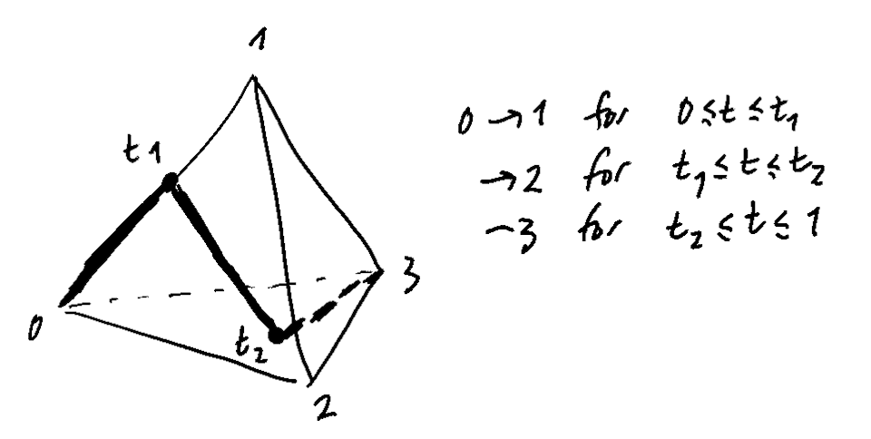

Earlier today, Mahmoud Zeinalian explained something to me that Dennis Sullivan once explained to him, and it's been sitting in my brain ever since then.
In an attempt to empty out my thoughts, and also preserve what little understanding I currently believe to have of the story, I thought I'd write a little blog post about it.
It's going to move quite quickly, because I don't want to spend time developing the prerequisites --- the main purpose is for this to jog my brain two weeks down the line when I forget all the details!

<!-- more -->

The rather "provocative" statement that I'm going to try to justify today is the following:

> *Every principal bundle is flat, from the $(\infty,1)$-point-of-view.*

Let's give some setup and explain why, first of all, this should sound rather bizarre, if not completely incorrect.

# The setup

Pick some principal $G$-bundle $\pi\colon E\to B$, endowed with a connection $\nabla$.
We're going to look at what sort of information we can associated to singular cells in the base space $B$, using the things that we have available to us.

We know that the fibre $E_b=\pi^{-1}(b)$ of $E$ at any point $b\in B$ "looks like" the group $G$, so, using the axiom of choice if we have to (or whatever really --- we're playing fast and loose here!), pick an element in each fibre to be the identity element of $G$.
That is, *very* discontinuously think of all the fibres as copies of $G$.

Now let's look at what a $1$-simplex (i.e. a line) in $B$ gives us.
Say the line goes from the point $b$ to the point $b'$.
We get a $G$-equivariant map $\Gamma_b^{b'}\colon E_b\to E_{b'}$ by using the parallel transport offered to us from the connection $\nabla$.
But, using the fact that we have already identified our fibres with $G$, and a nice technical lemma about Lie groups (saying (roughly) that, if a map commutes with all left actions, then it must be given by right action, i.e. by an element of the Lie group itself), we see that this is exactly the data of an element of $G$, say $g_{b,b'}$.

The next step is to think about what happens with $2$-simplices (i.e. triangles) in $B$.
If we call the three vertices $0$, $1$, and $2$, and label the edge between $i$ and $j$ by $ij$, then, by the above, the three edges will give us three elements $g_{01},g_{12},g_{02}\in G$.
But here is where things "break": it is *not* necessarily the case that $g_{12}g_{01}=g_{02}$; this identity that the notation suggestively implies is only true if $\nabla$ is flat!
(Recall: flatness of the connections corresponds to path-independence of the associated parallel transport).

So we've come to the conclusion that a bundle is flat if and only if... it is flat.
Great!

So how about this claim that *every* bundle is flat "from the $(\infty,1)$-point-of-view"?

# Some cubical wizardry

Trying to be ever so slightly more precise, we can formalise what we were doing in the above construction: for $p=1,2$, to each singular $p$-chain (i.e. each $p$-simplex) in $B$ we were associating a $(p-1)$-cube with values in $G$.
That is, were were constructing an element of the singular cochain complex on $B$ with values in "cubical chains with values in $G$", which we could write as
$$
    \varphi_\nabla \in \mathrm{C}^{\bullet,\mathrm{sing}}(B,\mathrm{C}_{\bullet-1}^\mathrm{cube}(B,G)).
$$
The fact that our connection is not flat is reflected in the fact that this element does not satisfy the Maurer--Cartan equation:
$$
    \mathrm{d}\varphi_\nabla+\varphi_\nabla^2 \neq 0
$$
where defining the product turns out to be really easy, because cubes, *unlike simplices*, actually satisfy "the product of two cubes is a cube".

So here's the question: we've constructed $\varphi_\nabla$ to be concentrated only in two (low) degrees; can we "extend" it to give an element that *does* satisfy Maurer--Cartan?
The answer is **YES**, and this is exactly what we mean by our opening claim that "every bundle is flat in the $(\infty,1)$-sense".
I won't spell out the details on how *exactly* this works (since I've already been very informal up until now anyway), but I'll show you some very lovely pictures, and then afterwards tell you where you can go to read about this in proper detail.

Thinking about what we need to "construct" in order to extend our element, we can guess that we need some sort of "homotopy" between $g_{12}g_{01}$ and $g_{02}$.
But how exactly can we do this?
And, further, how can we do it in a cubical way?

Well we know that every path in $B$ gives us an element of $G$, and we know that the path $02$ gives us $g_{02}$, and the composite path $01;12$ gives us the element $g_{12}g_{01}$, so let's draw a bunch of intermediate paths!
We can do this by starting at $0$, heading along the line $01$ *for some time $0\leq t_0\leq1$*, and then heading towards the point $2$ for the rest of the time $t_0-1$.
When $t_0=0$ we recover exactly the line $02$, and when $t_0=1$ we recover exactly the composite $01;12$; for intermediate values, we get something like in the (very hastily drawn) picture below:

What's wonderful is that, when we look at doing something similar for the $3$-simplex, we see that all our paths are parametrised by variables $0\leq t_0,t_1\leq 1$, i.e. by the $2$-cube!

# Behind the scenes, and some history

This whole story is really an explicit example of the *universal twisting cochain construction* for the path space bundle.
What do I mean by that?
Well, given any based topological space $(X,x_0)$, we have the (based) path space bundle $\mathcal{P}_{x_0}X\hookrightarrow X$ given by sending a path to its endpoint; the fibre at the point $x_0$ is exactly the (based) loop space.
Although this bundle doesn't have a connection, we can use the homotopy lifting property to get something akin to parallel transport.
We can make a nice simplification too: instead of looking at singular chains in $X$, we can look at singular chains in $X$ whose $0$-cells are all sent to the point $x_0$; somehow this carries the same "homological information" as the usual singular chain complex.
Then a $1$-simplex is exactly a loop based at $x_0$, which is exactly a $0$-simplex in the loop space --- this corresponds to the same "dimension drop" that we saw in the example above (where e.g. a line was sent to an element of $G$).

You know what?
At this point, I'm just going to give up trying to explain things any better.
Hopefully you're confused enough by my meandering and poorly-written exposé that you want to read some proper references.
This construction was described abstractly in J.F. Adams' "On the Cobar Construction"^[J. F. Adams, "On the Cobar Construction". *PNAS* **42** (1956), 409--412. [JSTOR:89694](https://www.jstor.org/stable/89694).];
the concrete description (using these paths parametrised by the $(p-1)$-cube) is found in Edgar H. Brown, Jr.'s "Twisted Tensor Products, I"^[Edgar H. Brown, Jr., "Twisted Tensor Products, I". *Annals of Mathematics* **69** (1959), 223--246. [DOI:10.2307/1970101](https://doi.org/10.2307/1970101).].

Enjoy!
