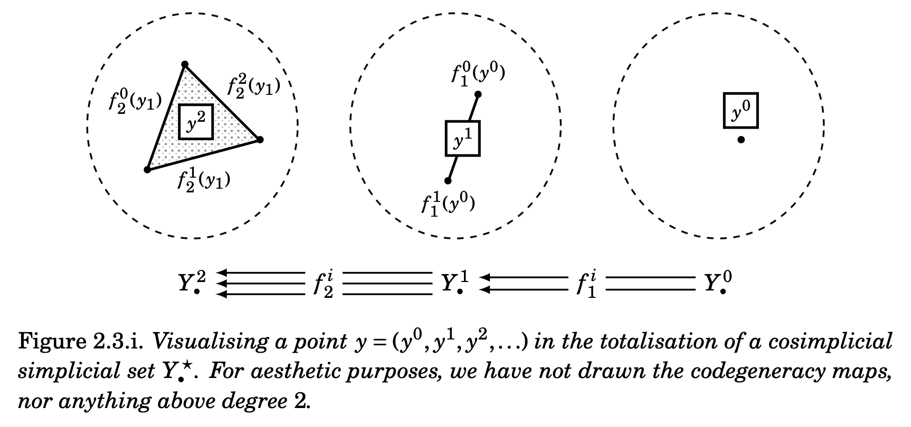
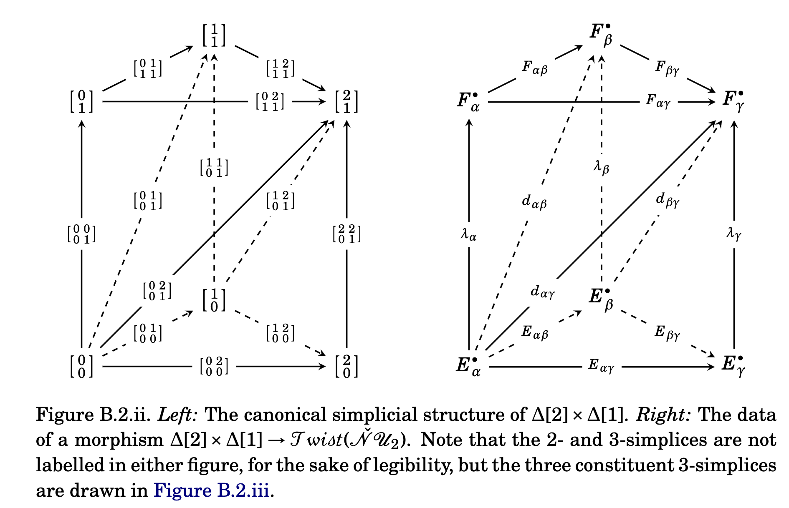

After a pretty long time (over two and half years or so), [Mahmoud Zeinalian](https://www.zeinalian.com/) and I have finished our paper "Simplicial presheaves of Green complexes and twisting cochains" (arXiv:[2308.09627](https://arxiv.org/abs/2308.09627)).
In this blog post I want to give a brief overview of one of the main technical tools that we use, which we call *Čech totalisation*.
The full story involves model categories and homotopy limits and all this sort of machinery, but the main part of this post will try to keep this to a minimum, and just talk about a surprisingly useful roundabout way of describing principal bundles.
There might be a second part to this, but for those interested or wanting for more details I recommend just delving into the paper --- I spent a lot of time trying to make it as readable as possible!

<!-- more -->

# The motivating example: principal $G$-bundles

Here's a really over-the-top way of constructing/defining principal $G$-bundles, whose usefulness we will soon come to justify.
We're first going to go very quickly, with an nLab-style approach, but we'll come back and explain things more concretely afterwards.

Let $G$ be a Lie group (i.e. a group object in the category $\mathsf{Man}$ of smooth manifolds).
Then Yoneda gives us a presheaf
$$
  y^G
  = \mathsf{Man}(-,G)
  \colon\mathsf{Man}^\mathrm{op}\to\mathsf{Set}
$$
but we can in fact endow this presheaf with the structure of a Lie group, by using the Lie group structure of $G$ "pointwise".
This means that we can deloop $y^G$ to obtain a presheaf of one-element groupoids
$$
  \mathbb{B}y^G
  = \mathbb{B}\mathsf{Man}(-,G)
  \colon\mathsf{Man}^\mathrm{op}\to\mathsf{Grpd}.
$$
In other words, given any smooth manifold $X$, we obtain a groupoid $\mathbb{B}y^G(X)$ with a single object $*$ and with endomorphism group $\operatorname{Hom}(*,*)\cong\mathsf{Man}(X,G)$.
Finally, for this step, we can take the categorical nerve $\mathcal{N}\colon\mathsf{Cat}\to\mathsf{sSet}$ to obtain a presheaf of simplicial sets
$$
  \mathcal{N}\mathbb{B}y^G
  \colon\mathsf{Man}^\mathrm{op}\to[\Delta^\mathrm{op},\mathsf{Set}].
$$
So if we go back and forget about our choice of $G$, instead leaving that open, we get a functor
$$
  \mathcal{N}\mathbb{B}y^{(-)}
  \colon\mathsf{LieGroup}\to[\mathsf{Man}^\mathrm{op},[\Delta^\mathrm{op},\mathsf{Set}]].
$$

Let's now think about covers.
Let $\mathsf{Man}_\mathcal{U}$ denote the category whose objects are pairs $(X,\mathcal{U})$ of a smooth manifold and a (good) cover, and whose morphisms $(X,\mathcal{U})\to(Y,\mathcal{V})$ are the morphisms $f\colon X\to Y$ in $\mathsf{Man}$ such that $\mathcal{U}$ is a refinement of $f^{-1}(\mathcal{V})$.
Then we can write the Čech nerve $\check{\mathcal{N}}$ as a functor
$$
  \check{\mathcal{N}}
  \colon\mathsf{Man}_\mathcal{U}\to[\Delta^\mathrm{op},\mathsf{Man}]
$$
and then the purely abstract fact that $[\mathcal{C},\mathcal{D}]^\mathrm{op}\cong[\mathcal{C}^\mathrm{op},\mathcal{D}^\mathrm{op}]$ for any categories $\mathcal{C}$ and $\mathcal{D}$ lets us apply an $\mathrm{op}$ to get a functor
$$
  \check{\mathcal{N}}^\mathrm{op}
  \colon\mathsf{Man}_\mathcal{U}^\mathrm{op}\to[\Delta,\mathsf{Man}^\mathrm{op}].
$$

We can precompose (which we write with as $(-)^*$) the above $\mathcal{N}\mathbb{B}y^{(-)}$ with this $\check{\mathcal{N}}^\mathrm{op}$ to obtain a single functor
$$
  (\check{\mathcal{N}}^\mathrm{op})^*\mathcal{N}\mathbb{B}y^{(-)}
  \colon\mathsf{LieGroup}\to[\mathsf{Man}_\mathcal{U}^\mathrm{op},\mathsf{csSet}]
$$
where $\mathsf{csSet}=[\Delta,[\Delta^\mathrm{op},\mathsf{Set}]]$ is the category of cosimplicial simplicial sets.
The very last step (for real this time) is to then *totalise* over the cosimplicial structure, i.e. to apply the functor $\operatorname{Tot}\colon\mathsf{csSet}\to\mathsf{sSet}$ that turns a cosimplicial simplicial set into a simplicial set in exactly the same way that taking the total complex turns a bicomplex into a complex (don't worry, we'll talk more about what this functor is later).
All in all, we get a simplicial presheaf on the category of smooth manifolds with chosen cover, namely
$$
  \operatorname{Tot}(\check{\mathcal{N}}^\mathrm{op})^*\mathcal{N}\mathbb{B}y^{(-)}
  \colon\mathsf{LieGroup}\to[\mathsf{Man}_\mathcal{U}^\mathrm{op},\mathsf{sSet}].
$$

Now comes the punchline.

::: {.itenv title="Theorem"}
For any Lie group $G$ and space with cover $(X,\mathcal{U})$, the simplicial set $\operatorname{Tot}(\check{\mathcal{N}}^\mathrm{op})^*\mathcal{N}\mathbb{B}y^{G}$ is the **space** of principal $G$-bundles.
:::

What do we mean by this?
Well, we are saying the following:

- the resulting simplicial set is actually a Kan complex, and thus earns the name of "space";
- the points of this space are exactly principal $G$-bundles;
- a path between two points in this space is exactly an isomorphism of principal $G$-bundles;
- there is no higher homotopical information.

We can actually even modify this construction to obtain a "space" where the paths are mere morphisms of principal $G$-bundles, but this is then only a *quasi-category* instead of a true space.

This story is very $1$-categorical, and can even be seen as a $1$-categorical version of §3.2.1 of "Čech cocycles for differential characteristic classes: an $\infty$-Lie theoretic construction" by Fiorenza, Schreiber, and Stasheff (DOI:[10.4310/ATMP.2012.v16.n1.a5](https://dx.doi.org/10.4310/ATMP.2012.v16.n1.a5)).
The $\infty$-categorical version turns up in the paper by me and Mahmoud in the following guise:

> *The space of twisting cochains is given by the Čech totalisation of the maximal Kan complex of the dg-nerve of the category of finitely generated free complexes.*

This may mean nothing to you (twisting cochains à la Toledo and Tong seem to be rather underappreciated in modern literature, imho), but I promise that it's a cool result (just not one that I have the space to delve into today).
In fact, you can take this as a motto if you like:

> *Twisting cochains are the $\infty$-analogue of vector bundles, a sort of "homotopy-coherent bundles".*

Now, I am sure that the $1$-categorical statement (concerning principal $G$-bundles) is a known result, even though I can't find it written down anywhere (except for in our paper).
Indeed, all it's really saying is that *"bundles are homotopy limits of locally trivial stuff"*.
Let's take this rather glib summary and try to see if we can understand it in more detail.

# The Čech nerve; totalisation and Reedy fibrancy

Given a cover $\mathcal{U}$ of a space $X$, the *Čech nerve* is the simplicial space given in degree $p$ by the disjoint union of all non-empty $p$-fold intersections of elements of $\mathcal{U}$, i.e.
$$
  \check{\mathcal{N}}\mathcal{U}_p
  = \coprod U_{\alpha_0\ldots\alpha_p}
$$
and the face and degeneracy maps are given by dropping/repeating indices $\alpha_i$.
If the cover is "good", then this gives a fibrant replacement of $X$, and so can be used to compute cohomology (or more general mapping spaces).
I love the Čech nerve --- I think it turns up in almost everything I write --- but I'd rather spend my little remaining energy describing totalisation instead.

The prototypical cosimplicial simplicial set is
$$
  \begin{aligned}
    \Delta[\star]
    \colon\Delta
    &\to\mathsf{sSet}
  \\ [p]
    &\mapsto\Delta[p]=\operatorname{Hom}_\Delta(-,[p])
  \end{aligned}
$$
which we can think of as "all of the simplices $\Delta[p]$ gathered together".
This lets us define a functor
$$
  \begin{aligned}
    L
    \colon\mathsf{sSet}
    &\to\mathsf{csSet}
  \\Y_\bullet
    &\mapsto Y_\bullet\times\Delta[\star]
  \end{aligned}
$$
and this admits a right adjoint, which we call *totalisation*
$$
  \begin{aligned}
    \operatorname{Tot}
    \colon\mathsf{csSet}
    &\to\mathsf{sSet}
  \\Y_\bullet^\star
    &\mapsto \underline{\operatorname{Hom}}_\mathsf{csSet}(\Delta[\star],Y_\bullet^\star)
  \end{aligned}
$$
where we make use of the fact that $\mathsf{csSet}$ is enriched over $\mathsf{sSet}$ via
$$
  \left(\underline{\operatorname{Hom}}_\mathsf{csSet}(A_\bullet^\star,B_\bullet^\star)\right)_p
  = \operatorname{Hom}_\mathsf{csSet}(A_\bullet^\star\times\Delta[p],B_\bullet^\star).
$$

The particularly useful fact about totalisation is the following:

> *If $Y_\bullet^\star\in\mathsf{csSet}$ is Reedy fibrant, then its totalisation and its homotopy limit are naturally weakly equivalent.*

There are lots of ways of thinking about totalisation, but there's a very nice one that comes in useful for explicit calculations, namely that *a point in the totalisation $\operatorname{Tot}Y_\bullet^\star$ consists of $(y^0,y^1,\ldots)$ with $y^p\in Y_p^p$ such that "they all glue together"*.
Of course, the end of this sentence is very vague, and I don't really want to type out everything from the paper again, but I'll include a nice picture here that sort of describes the idea.

Trying to understand higher simplices in the totalisation is a bit of a mess, but it turns out that there is a really nice combinatorial approach involving paths of $1$-simplices in products $\Delta[p]\times\Delta[q]$ (see Appendix B.2 in "Chern character for infinity vector bundles", by Glass, Miller, Tradler, and Zeinalian (arXiv:[2211.02549](https://arxiv.org/abs/2211.02549))).
In the paper by me and Mahmoud, we calculate some $1$-simplices explicitly, showing that they recover pre-existing notions of weak equivalences between objects that some people really care about.
Below is a nice picture from one of the proofs without any further explanation.

# The Čech totalisation functor

The story in the previous section is a retelling of what Mahmoud explained to me almost three years ago now, and this kickstarted the project that became the paper now on the arXiv.
In "Chern character for infinity vector bundles", by Glass, Miller, Tradler, and Zeinalian (arXiv:[2211.02549](https://arxiv.org/abs/2211.02549)), the same two-step fundamental construction turns up:

1. apply the Čech nerve to a simplicial presheaf;
2. totalise the resulting cosimplicial simplicial presheaf.

This combination is what we call *Čech totalisation*, and it can be understood as a sort of partial sheafification.
Indeed, if applied to a presheaf of mere sets, then it recovers the usual process sheafification given by taking sections of the espace étalé (though I must admit that this is not actually explicitly worked out anywhere in writing).
There are actually some more general results about when this Čech totalisation does actually compute the sheafification, and you can find these in §5.1 of the Glass, Miller, Tradler, Zeinalian paper mentioned above.
But it turns out to be an interesting construction even without thinking about sheafification.

Let's start with a proper definition.

::: {.rmenv title="Definition"}
Let $\mathcal{F}\colon\mathsf{Space}^\mathrm{op}\to\mathsf{sSet}$ be a simplicial presheaf on the category of spaces, and let $X\in\mathsf{Space}$ be a space with cover $\mathcal{U}$.
We define the *Čech totalisation of $\mathcal{F}$ at $\mathcal{U}$* to be the simplicial set given by $\operatorname{Tot}\mathcal{F}(\check{\mathcal{N}}\mathcal{U}_\bullet)$, i.e. the totalisation of the cosimplicial simplicial set given by evaluating $\mathcal{F}$ on the Čech nerve of $\mathcal{U}$.
:::

Here are some things that we show in our paper, *under the assumption that we have presheaves of Kan complexes* (i.e. "globally fibrant" simplicial presheaves).

1. The Čech totalisation of $\mathcal{F}$ is a Kan complex.
2. If $\mathcal{F}$ and $\mathcal{G}$ are weakly equivalent to one another, then their Čech totalisations are weakly equivalent to one another.
3. The Čech totalisation computes the homotopy limit (this is due to the fact that evaluating on the Čech nerve gives a Reedy fibrant cosimplicial simplicial set).

These facts turn out to be useful for our intended applications (maybe I haven't made this very clear, but Čech totalisation is only really a tool in our paper, used to study a rather different problem!) but we can also use them to compare to the existing results in the literature concerning homotopy limits of presheaves of dg-categories.
In "Explicit homotopy limits of dg-categories and twisted complexes", by Block, Holstein, and Wei (arXiv:[1511.08659](https://arxiv.org/abs/1511.08659)), it is explained how to calculate homotopy limits of presheaves of dg-categories by using the fact that totalisations of Reedy fibrant objects are weakly equivalent to their homotopy limits.
The nice (but expected) result that we show is that one can switch from presheaves of dg-categories to simplicial presheaves by taking the dg-nerve (followed by the maximal Kan complex) without changing the resulting object.
More precisely:

::: {.itenv title="Theorem"}
Let $\mathcal{F}\colon\mathsf{Space}^\mathrm{op}\to\mathsf{dgCat}$ be a presheaf on the category of spaces that sends finite products to coproducts, and let $X\in\mathsf{Space}$ be a space with cover $\mathcal{U}$.
Then there is a weak equivalence of Kan complexes
$$
  \operatorname{Tot}\langle\mathcal{N}^\mathrm{dg}\mathcal{F}(\check{\mathcal{N}}\mathcal{U})\rangle
  \simeq
  \langle\mathcal{N}^\mathrm{dg}\big(\operatorname{Tot}\mathcal{F}(\check{\mathcal{N}}\mathcal{U}\big))\rangle
$$
where we write $\langle-\rangle$ to denote the maximal Kan complex, and on the left-hand side we are taking the totalisation of cosimplicial simplicial sets, and on the right-hand side we are taking the totalisation of cosimplicial dg-categories.
:::

# Applications

So what do Mahmoud and I actually use Čech totalisation for in our paper?
Well, if you actually want to know the answer to that, then I recommend just having a look at either the introduction or the section named "Narrative" in the actual paper itself, since these are written with minimal technical details.
However, here's a very quick version of the story (and each sentence is justified with real details somewhere in the paper, I promise).

> Locally free sheaves (read: "vector bundles") on ringed spaces (read: "schemes", "manifolds", or whatever geometric thing you like) are very interesting, but they're very homotopically rigid.
> In fact, when we look at complex-analytic (i.e. holomorphic) manifolds, they become too rigid, and we can't always break down problems about coherent sheaves (the things that geometers often really care about) into problems about locally free ones.
> There is a solution to this: the **twisting cochains** of Toledo and Tong, which are like homotopy-coherent locally free sheaves, and are very related to the dg-nerve.
> There is another solution though: the **Green complexes** of Green (a student of O'Brian, a co-author of Toledo and Tong), which are very related to simplicial objects.
> These two things share a common generalisation, namely **simplicial twisting cochains**.
>
> What is the relationship between these three things?
> Is there some sort of Dold--Kan correspondence?
> Can we place them all in a unified framework, and use the tools of homotopy theory to talk about them?
> What does this tell us about the geometry of complex-analytic manifolds?
> What does this tell us about geometry more generally?
> And do we learn anything about presheaves of dg-categories along the way?

As always, I'd love to talk about this stuff with anybody interested --- please do reach out if you like!
