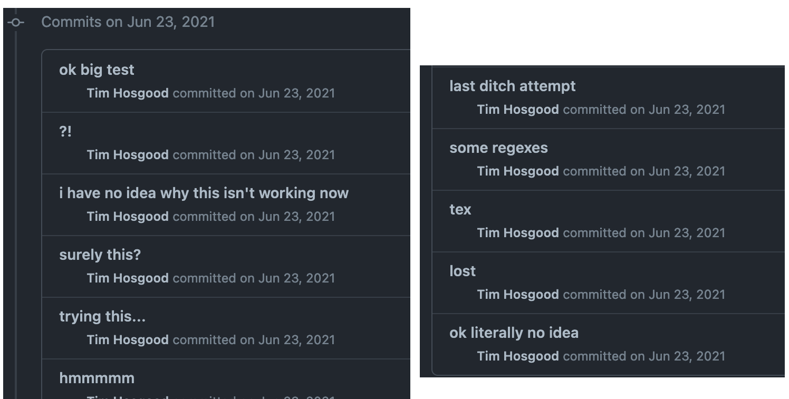

Briefly: two very short translations concerning geometry, and the final two seminars of FGA (thus finishing a complete first draft of the entire FGA seminar series).

<!-- more -->

Let's start with the two short papers that I needed to read for various reasons:

- P Donato, P Iglesias, "Exemples de groupes differentiels: flots irrationnels sur le tore". *C. R. Acad. Sc. Paris* **301** (1985) pp. 127--130. [HTML](https://labs.thosgood.com/translations/CRASP-301-1985-127.html)
- PF Sánchez, "Automorfismo de foliaciones holomorfas sobre superficies racionales". *Pro Mathematica* **16** (2002) pp. 47--59. [HTML](https://labs.thosgood.com/translations/PM-16-2002-47.html)

Then there's the one I've been slowly chipping away at, on and off, since --- GitHub tells me --- June 2021.
I've now finished the last two seminars of FGA, both on Picard schemes:

- Grothendieck, A. "Technique de descente et théorèmes d’existence en géométrie algébrique, V and VI". *Séminaire Bourbaki* **14** (1961/62), Talks no. 232 and 236. [HTML](https://thosgood.com/fga)

This means there's a complete (imperfect, sure) copy of FGA now digitised (and thus searchable!) online, and I'm going to take a break from it for a while before coming back with fresh eyes at some undetermined point in the future to catch all the typos and errors.
Of course, if you happen to see any yourself then please do let me know!

Anyway, I'll leave you with an insight into how much I struggled getting GitHub to automate the Bookdown build process for [the FGA page](https://thosgood.com/fga) on the 23rd of June, 2021, as well as how unhelpful my git commit messages would be to anybody reading them.

