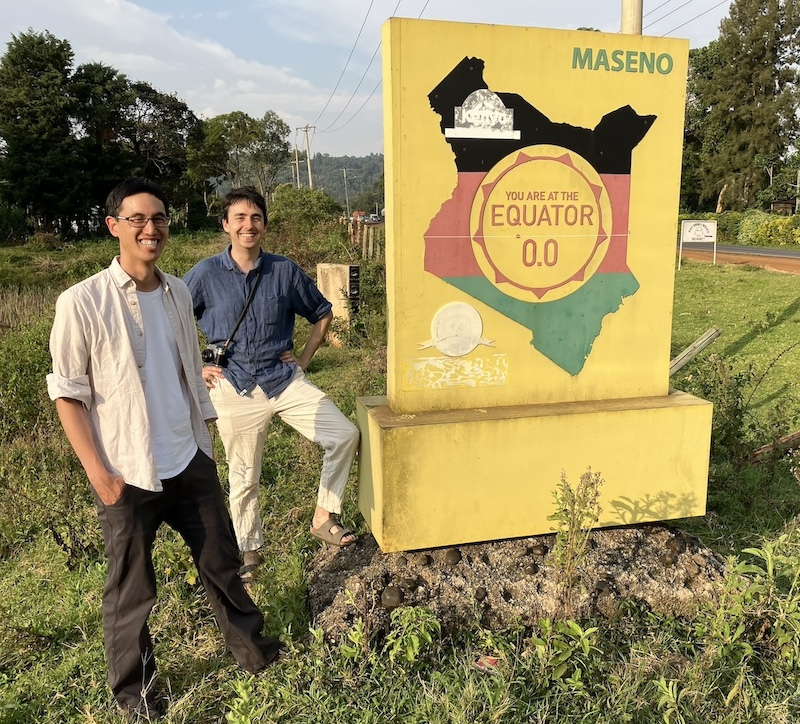

I managed to forget to write a blog post for the entirety of 2024 --- wow!
Let's see if I can zip through some things that have happened in the past 14 months.

<!-- more -->

I finished my two-year postdoc position at Stockholm University at the end of 2023, and then went immediately to [OIST](https://oist.jp) in Okinawa for three months as a [visitor](https://www.oist.jp/research/research-units/qis/visitors) to the Quantum Information Security Unit, headed up by [Artur](https://www.arturekert.org/), where I spent most of my time writing and rewriting various parts of [qubit.guide](https://qubit.guide/) in order to get it ready for print publication, joint with Alastair Kay and Chiara Macchiavello.

After that, I moved back to Oxford (yet again) to teach the quantum information course again (also gaining student feedback and suggestions to improve [qubit.guide](https://qubit.guide/) even more), but, on a longer-term scale, to formally join the [Topos Institute](https://topos.institute/) as Director of UK Operations.
That's such a fancy title compared to what I've been before, but my role has essentially been to figure out how to start a partner institute here in the UK and join in on the community building work that's already happening here for what might be glibly (but also rather accurately) described as *compassionate applied mathematics*.
This is one reason I haven't been blogging here so much, because I've been writing some posts over at the [Topos Institute blog](https://topos.institute/blog/).
One [particular post](https://topos.institute/blog/2024-09-06-open-source-curriculum-workshop/) was about a trip to Kisumu, Kenya, to a workshop on open curricula and assessment tools for mathematics, which was an absolutely fantastic workshop, both in terms of topics and attendees.
Hopefully soon I'll be writing even more about Topos here in the UK, but I'd rather keep this post short so I can finish it (these days if I take a break from writing then I almost never find the energy to return).

Another delightful event was organising the [Second Virtual Workshop on Double Categories](https://bryceclarke.github.io/virtual-double-categories-workshop/) with [Bryce](https://bryceclarke.github.io/), following the previous one that we organised ran in 2022.
It's always a delight to run any sort of event with Bryce, but the invited speakers, and all the participants, made it even more delightful again.
As a sort of side activity to this, I have been working on two translations of papers by Charles Ehresmann that were fundamental in the introduction of double categories, as suggested by Bryce and Andrée Ehresmann herself: "Catégories doubles et catégories structurées" (a short note) and "Catégories structurées" (a much longer paper).
The former is finished ([[PDF]](https://translations.thosgood.com/CRAS-256-1963-1198.pdf), [[source]](https://github.com/thosgood/translations/blob/main/latex/CRAS-256-1963-1198.tex)) and I'm about halfway through the latter.

Also on translation, I've been invited to speak at a workshop at the [Isaac Newton Institute](https://www.newton.ac.uk/) as part of the [Modern History of Mathematics](https://www.newton.ac.uk/event/mhm/) programme.
Here's a copy of my title and abstract at the moment:

> **Open translations in mathematics.**
>
> Translation, in full generality, is a nuanced and complex art form that requires serious expertise and a holistic approach. So how can we as mathematicians hope to "solve the problem of translation" in our domain? Furthermore, can we do so without making access to academia even harder for non-native English speakers or hurrying a domain collapse of non-English languages? I believe that the answer to both of these questions can only possibly be "yes" if we approach translation as a community-driven activity.
>
> In this talk, I will speak about my experiences in working on large translation projects with an open-source approach — the technology and methodology that was helpful for doing so, as well as some of the difficulties — and describe the sorts of resources that I believe would have been helpful. Hopefully this can form a starting point for community thought on the types of projects that we could focus on in the future.

As for geometry, I gave a talk at the [New York City Category Theory Seminar](https://www.sci.brooklyn.cuny.edu/~noson/Seminar/index.html) on "loose simplicial objects", which are a generalisation of the
[My talk](https://www.youtube.com/watch?v=YpOpKzfXRl8) wasn't very good (I severely ran out of time), but [the slides](https://thosgood.com/assets/files/loose-simplicial-objects.pdf) are available, and hopefully there'll be a real paper on the arXiv this year.
I'm currently thinking about what Clausen (et al) call the "modified Hodge conjecture", but entirely by accident --- it just so happens that the relationship between holomorphic Deligne cohomology and refined notions of coherent analytic sheaves are two things that have been surrounding my research for the past eight years now!

I also took up knitting and my mum showed me how to knit a chicken.
It was, like many things, frustrating at times, but very much worth it.

](chicken.jpg)
